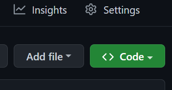
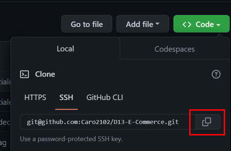

# D13-E-Commerce
Backend para un sitio web de comercio electrónico.

---
  ## Contenido
  1. [Enlaces](#enlaces)
  2. [Instalación](#instalación)
  3. [Uso](#uso)
  4. [Contribución](#contribución)
  
---
## Enlaces

**[Funcionalidad de la aplicación ](https://youtu.be/DuLPyuhrSiU "click")**.

**[URL de repositorio de GitHub](https://github.com/Caro2102/D13-E-Commerce "click")**.

---
  ## Instalación
- Clonar repositorio
    - Abrir el siguiente link **[URL de repositorio de GitHub](https://github.com/Caro2102/D13-E-Commerce "click")**.
    - Hacer click en <> Code.

        
    - Copiar la direccion URL del repositorio.

        
    - Abrir GitBash.
    - Ir a la ubicacion en donde quieres clonar el repositorio.
    - Escribir **`git clone`** y pegar la url antes copiada.
    - Presionar enter para clonar.

- Instalar node desde la pagina oficial **[NodeJS web Oficial](https://nodejs.org/es/ "click")**.
    - Abrir GitBash.
    - Ir a la ubicacion en donde se clonó el repositorio.
    - Escribir **`npm i`** para instalar las dependencias del proyecto.
    - Con esto instalaremos todas las dependecias que tengamos en el package.json y nos creará una carpeta llamada **node_modules** con las dependencias listas para utilizar.
     Dirijirse a la raíz de la carpeta y crear archivo **`.env`** para agregar las siguientes variables para proteger las credenciales de la base de datos y poder conectarse.
     
            DB_NAME='nombre de la base de datos'
            DB_USER='nombre de usuario'
            DB_PASSWORD='tu contraseña de MYSQL'
        
    - Escribir **`mysql -u root -p`** para conectarse a MySQL CLI e igresar contraseña.
    - Escribir **`source schema.sql`** para crear la base de datos MySQL (Asegurarse que la ruta sea correcta).
    - Escribir **`npm run seed `** para agregar datos a la base de datos y poder comprobar las rutas (opcional).
    - Escribir **`npm start`** para ejecutar el archivo.

---
## Uso
1. Despues de seguir los pasos de [Instalación](#instalación) y haber ejecutado el programa.
2. Testear la aplicación usando un software como **[Insomnia Core](https://insomnia.rest/ "click")**
3. Ver **[video](https://youtu.be/DuLPyuhrSiU "click")** de funcionalidad para comprobar rutas.

---
## Contribución:
    
  Para contribuir con este proyecto:
- Fork del repositorio.
- Clonar el  repositorio.
- Actualizar la rama master.

        $git pull -r upstream master
- Crear rama.

        $ git checkout -b feature-nombre-rama
- Realizar cambios, agregarlos, hacer commit y despues hacer push hacia nuestro repositorio indicando la rama que hemos creado.

        $ git push origin feature-nombre-rama
- Hacer un Pull Request.
- Esperar que el codigo se acepte y se haga merge.

